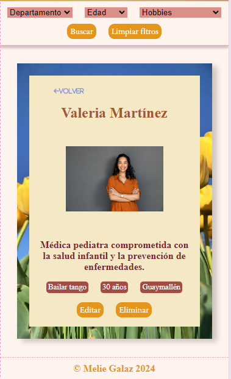
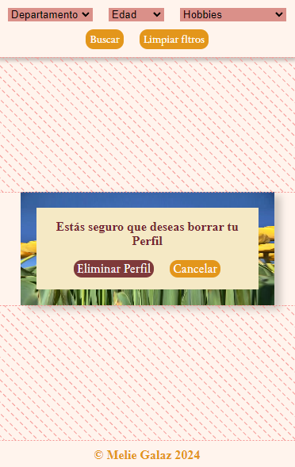

# Buscador de amigas en Mendoza

Esta aplicación esta pensada para hacer amigas nuevas de acuerdo a cosas en común como hobbies, lugar de residencia o edad.

## Descripción

Lo primero que se ve es el logo de la app, el nombre de ella Conecta Amigas MZA, el botón de agregar perfil, los fitros de departamento edad y hobbies, los botones de buscar( después de colocar algun filtro) y limpiar filtros cuando ya no sean usados.
se ven también las card precargadas de 30 mujeres, la información para llenar esas card esta guardada en mockapi y toda la app es renderizada y es mostrada atraves de peticiones GET, POST, PUT y DELETE.

## Agregar perfil

Al tocar el botón Agregar Perfil se abre una nueva card donde se puede completar un formulario con todos los datos necesarios para un card nueva todos esos datos se guardan en la Api de mi proyecto en mockapi y se ve cargada al igual que las demás que ya existían anteriormente.

## Ver Más

El botón de ver más abre una card donde se ve la descripción completa ademas se le agregan dos botones uno de eliminar el perfil y otro para editarlo, este ultimo es un formulario que tiene cargada la información de la persona y se puede cambiar cada parte si asi se desea.

Al tocar el botón eliminar se abrirá una advertencia preguntando si esta seguro de eliminar el perfil.Si se tocal el Eliminar Perfil se elimina totalmente de la app y de mokapi.
Si se toca Cancelar se cierra y se vuelve al paso anterior con la card elegida para ver más en detalle.

Al tocar Editar se abre abajo un formulario con al información de la card seleccionada precargado para poder cambiar lo que sea necesario, estos cambios también se suben a mokapi al tocar editar se da por gradados los cambios.También tiene un botón de cancelar por si no se quieren realizar cambios y este cierra el formulario dejando solo la card.

## Construido Con

Las tecnologías que utilize para construir este proyecto:

- Maquetado HTML
- Estilos Sass
- Funcionalidad JAVASCRIPT

## Autor

- ** MELIE GALAZ **

## Link para usar la app

https://meliegalaz.github.io/ConectaAmigasMZA/
